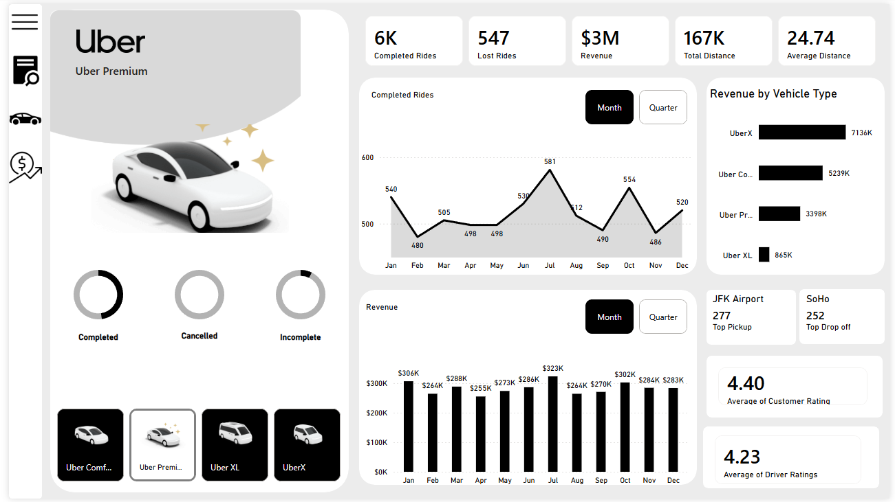
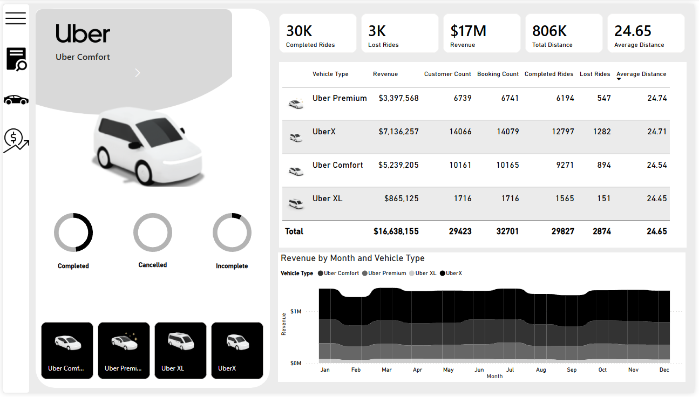

# An interactive Power BI dashboard analyzing Uber ride data across vehicle types, revenue trends, and operational performance metrics.

*📊 Dashboard Preview*

**Home**

Landing page with navigation to the four main sections of the report.

 

-----

**Overview**

High-level KPIs and performance summary:

-----

**Vehicle**

Detailed breakdown by vehicle type with a comparison table:

-----

**Revenue**

 Revenue analysis including:
- Monthly revenue vs. previous month comparison
- Revenue by payment method (Cash, Uber Wallet, Credit Card, Debit Card)
- Revenue by customer

----

**Key Insights**

- UberX is the top-performing vehicle type, generating 43% of total revenue ($7.1M)

- Cash is the most used payment method, accounting for 1.51M in revenue

- Revenue remains stable throughout the year, ranging between $0.25M–$0.30M per month

- The overall Lost Rides rate is approximately 9% (2,874 out of 32,701 bookings)

- JFK Airport is the most popular pickup location, confirming strong airport demand

**Author**

Gianluca La Barbera

https://www.linkedin.com/in/gianluca-la-barbera/

**Dataset**

Source: https://www.youtube.com/watch?v=lkMYkUMz4RM

Period: Full year (January – December)

This project is open source and available under the MIT License.ShareContent
